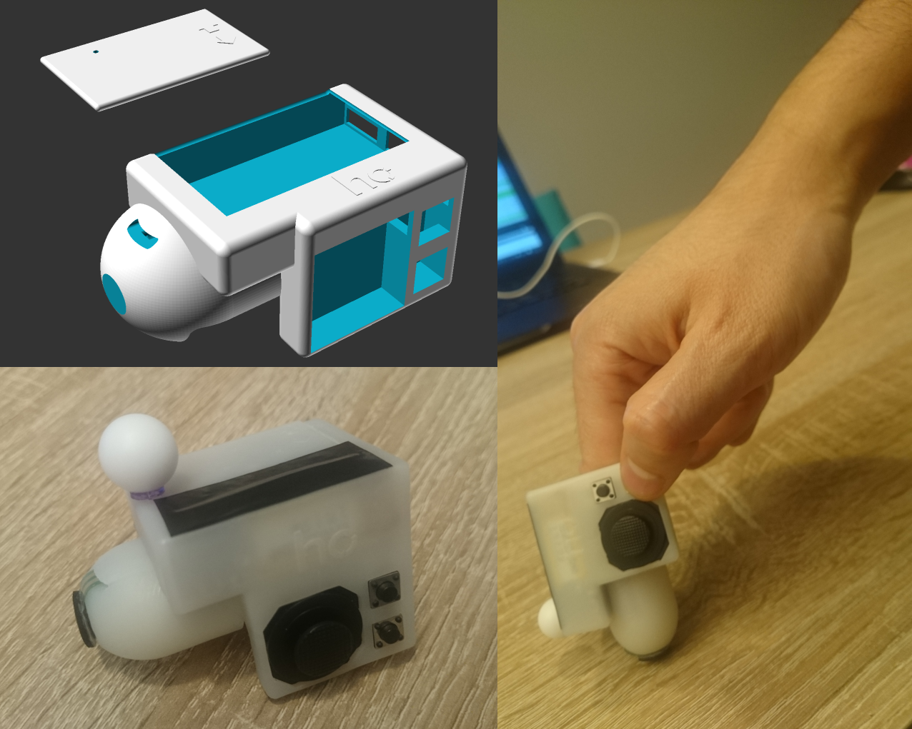

# HapFinger
<b>Vibrotactile Fingercap for Wireless Tabletop/3D Interaction</b>

HapFinger is a fingertip-worn wireless (Bluetooth 2.4 GHz Band) device to be used in the index finger.
A vibrating element is located right at the fingertip and is controlled by embedded software that controls the intensity according to signals received from the computer. The case encloses an RF51822 SoC (System on a Chip) based on a 32-bit ARM Cortex.
The device provides feedback with a Linear Resonant Actuator (LRA, 5mm diameter x 3mm thickness, Precision Microdrives C10-100) spinning at a resonant frequency of 200Hz while variating the intensity from level 0 to 128 and controlled by a dedicated haptic driver (TI DRV2605L) and supporting overdriving and active braking.
It is also possible to attach an IR marker and enable position tracking with external cameras and use the pressure sensure in the fingertip to design tabletop-based interaction techniques. As additional input, the device features two tactile buttons and an analog joystick wich can be easily accesed with the thumb.
The device was 3d modeled as a finger contoured electronic enclosure. The device case was 3d-printed with resin material and the total weight, including the battery, is 31 grams.

This repository contains all the necessary files to build a new device; model files for 3D printing, schematics for electronics, embedded software binaries, source code of a BLE server to stablish a wireless device connection from a computer and the source code of an Unity demo application featuring vibrotactile feedback in a 3D environment.

Analysis of Proximity-Based Multimodal Feedback for 3D Selection in Immersive Virtual Environments 
Oscar Ariza, Gerd Bruder, Nicholas Katzakis, Frank Steinicke 
IEEE Virtual Reality (VR) 
2018
